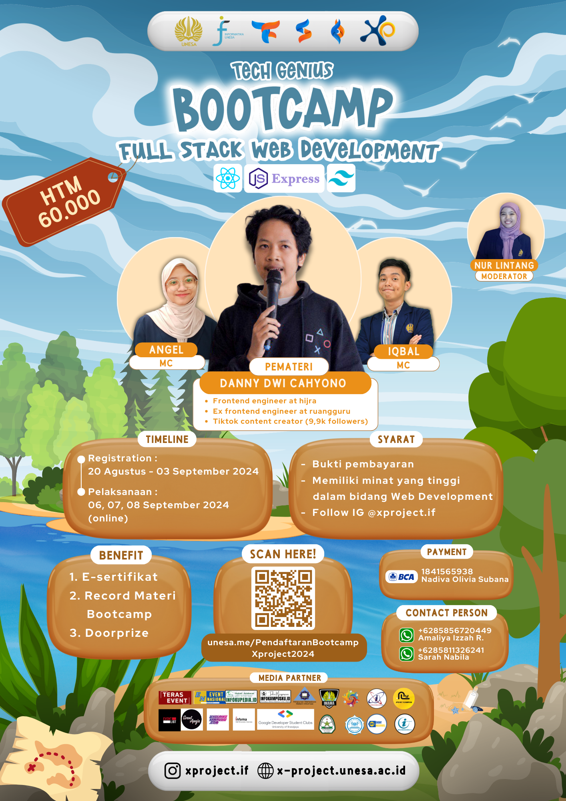

# Inventory Management System

This project is an Inventory Management System built with Node.js, Express, MongoDB, and Mongoose. It includes user authentication (register and login) and CRUD operations for managing products. The API endpoints are protected using JWT authentication.

## Table of Contents

- [Features](#features)
- [Installation](#installation)
- [Usage](#usage)
- [API Endpoints](#api-endpoints)
  - [Authentication](#authentication)
  - [Products](#products)
- [Tech Genius Bootcamp](#tech-genius-bootcamp)

## Features

- User registration and login with JWT authentication
- CRUD operations for products
- Protected routes for product management

## Installation

1. Clone the repository:

   ```sh
   git clone https://github.com/dannycahyo/invenflow-api.git
   cd invenflow-api
   ```

2. Install dependencies:

   ```sh
   npm install
   ```

3. Create a `.env` file in the root directory and add the following environment variables:

   ```env
   PORT=3001
   MONGO_URI=your_mongodb_connection_string
   JWT_SECRET=your_jwt_secret
   ```

4. Start the server:
   ```sh
   npm start
   ```

## Usage

### Register a New User

- **Method**: POST
- **URL**: `/api/auth/register`
- **Body**:
  ```json
  {
    "name": "John Doe",
    "email": "john@example.com",
    "password": "password123"
  }
  ```

### Login

- **Method**: POST
- **URL**: `/api/auth/login`
- **Body**:
  ```json
  {
    "email": "john@example.com",
    "password": "password123"
  }
  ```
- **Response**:
  ```json
  {
    "token": "your_jwt_token_here"
  }
  ```

### Access Protected Routes

Include the JWT token in the `Authorization` header as follows:

- **Key**: `Authorization`
- **Value**: `Bearer your_jwt_token_here`

## API Endpoints

### Products

#### Retrieve All Products

- **Method**: GET
- **URL**: `/api/products`
- **Headers**:
  - `Authorization`: `Bearer your_jwt_token_here`

#### Retrieve a Single Product by ID

- **Method**: GET
- **URL**: `/api/products/:id`
- **Headers**:
  - `Authorization`: `Bearer your_jwt_token_here`

#### Add a New Product

- **Method**: POST
- **URL**: `/api/products`
- **Headers**:
  - `Authorization`: `Bearer your_jwt_token_here`
- **Body**:
  ```json
  {
    "name": "Laptop",
    "price": 999.99,
    "quantity": 10,
    "category": "Electronics"
  }
  ```

#### Update an Existing Product

- **Method**: PUT
- **URL**: `/api/products/:id`
- **Headers**:
  - `Authorization`: `Bearer your_jwt_token_here`
- **Body**:
  ```json
  {
    "name": "Laptop",
    "price": 1099.99,
    "quantity": 8,
    "category": "Electronics"
  }
  ```

#### Delete a Product by ID

- **Method**: DELETE
- **URL**: `/api/products/:id`
- **Headers**:
  - `Authorization`: `Bearer your_jwt_token_here`


## Tech Genius Bootcamp

This project is part of the Tech Genius Bootcamp Full Stack Web Development conducted by the Informatics students of the State University of Surabaya. The bootcamp aims to provide hands-on experience in building full-stack web applications using modern technologies.

See the Frontend Project [here](https://github.com/dannycahyo/invenflow-ui).


